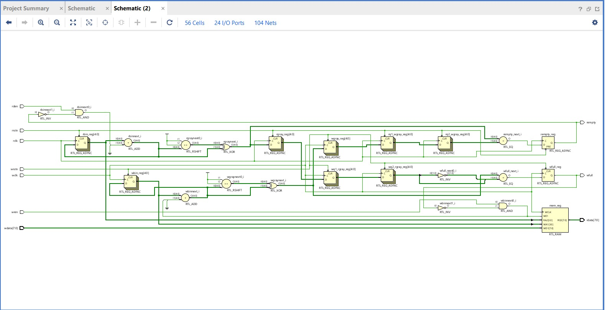
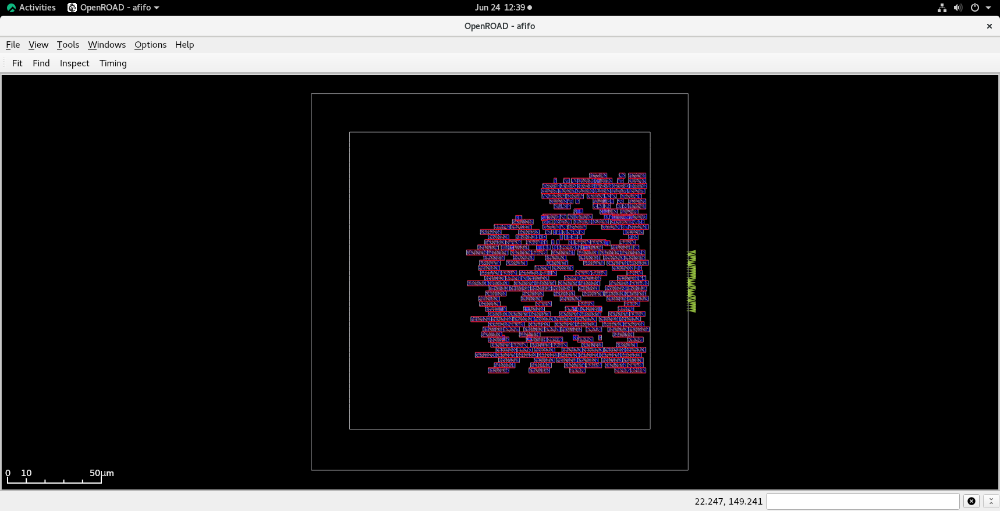
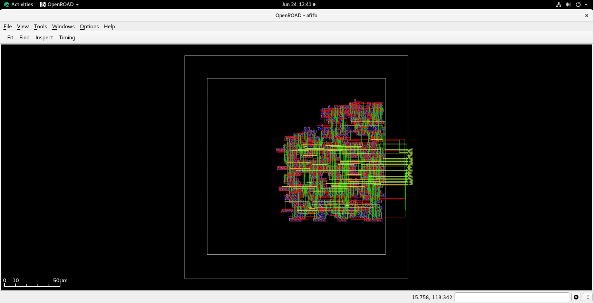
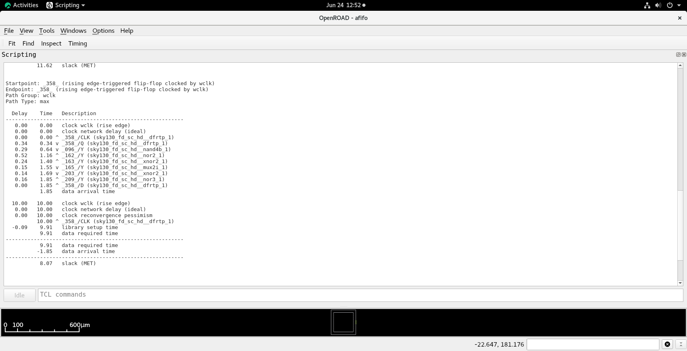
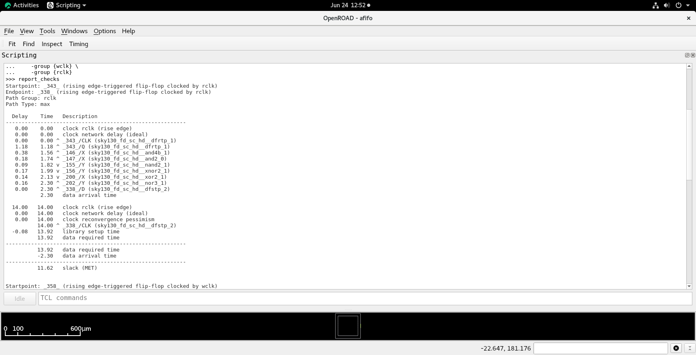

# Asynchronous FIFO RTL-to-Physical Design Flow using OpenROAD and Sky130

## Overview

This project implements an Asynchronous FIFO (AFIFO) in Verilog and carries it through a complete RTL-to-Physical Design flow using Yosys and OpenROAD on the Sky130HD technology library.

The design contains independent read and write clock domains and uses Gray-code pointer synchronization to safely transfer status information across clock domains.

## Design Flow

RTL Design → Synthesis → Floorplanning → Placement → Clock Tree Synthesis → Static Timing Analysis → Global Routing → Detailed Routing

## Tools Used

* Verilog HDL
* Yosys
* OpenROAD
* OpenSTA
* Sky130HD Standard Cell Library

## Results

| Metric               | Value     |
| -------------------- | --------- |
| Technology           | Sky130HD  |
| Standard Cells       | 287       |
| FIFO Flip-Flops      | 128       |
| Utilization          | 25%       |
| CTS Buffers Inserted | 20        |
| Write Clock Period   | 10 ns     |
| Read Clock Period    | 14 ns     |
| Write Clock Slack    | +8.07 ns  |
| Read Clock Slack     | +11.62 ns |
| DRC Violations       | 0         |

## Screenshots

### RTL Netlist



### Floorplan


### Placement and CTS



### Routed Design



### Timing Analysis

#### Write Clock Domain



#### Read Clock Domain



## Repository Structure

```text
rtl/
constraints/
synthesis/
openroad/
results/
docs/
images/
```

## Key Learning Outcomes

* RTL Design using Verilog HDL
* Clock Domain Crossing (CDC)
* Gray-Code Pointer Synchronization
* Logic Synthesis using Yosys
* Floorplanning and Placement
* Clock Tree Synthesis (CTS)
* Static Timing Analysis (STA)
* Global and Detailed Routing
* Physical Design using OpenROAD
* Open-Source ASIC Design Flow

## Author

Katta Karthikeya

B.Tech Electronics and Communication Engineering
PDPM IIITDM Jabalpur

Interests:

* RTL Design
* ASIC Design
* FPGA Design
* Physical Design
* Open-Source Silicon Design
